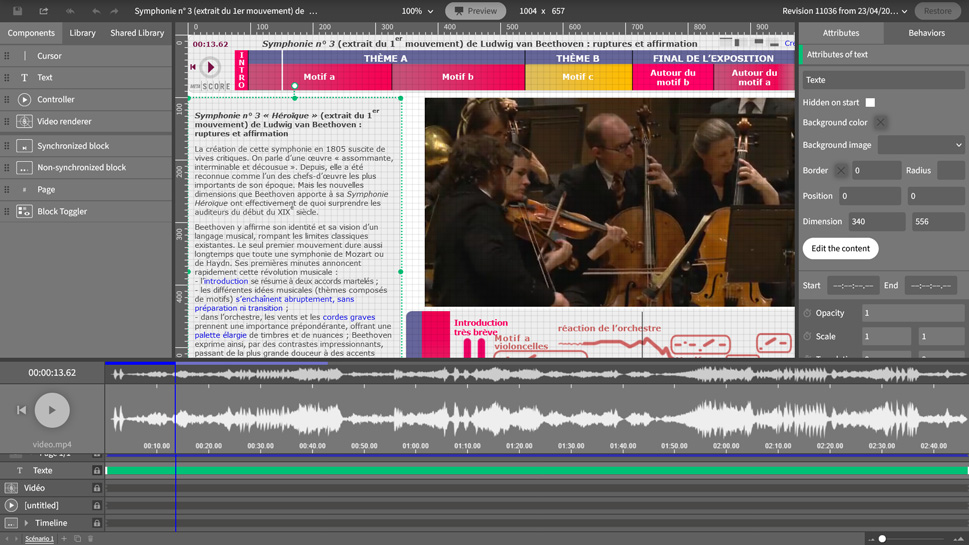

# metaScore-library

[](README.md)
[](README.en.md)

Développé par la [La Cité de la musique - Philharmonie de Paris](https://philharmoniedeparis.fr), metaScore est une plateforme de publication et un outil d'édition de supports éducatifs musicaux. Il est conçu pour les enseignants et les professionnels de la musique et de la médiation culturelle.

L'éditeur metaScore et de nombreux exemples de réalisations sont [disponibles ici](https://metascore.philharmoniedeparis.fr/)

La librairie _metaScore-library_ fait fonctionner la partie front-end de la plateforme.

La librairie fournit:
* un __Player__ pour consulter et interagir avec les applications
* un __Editeur__ pour créer et modifier les applications
* et une __API__ pour interagir via du code avec les players embarqués 



## # Sommaire

* [Quick start](#quick-start)
* [Releases](#releases)
* [Développement](#development)
* [Contribution](#contributing)
* [License](#license)
* [Crédits](#credits)
* [Copyright](#copyright)

<a name="quick-start"></a>
## # Quick start

### Prérequis

La _metaScore-library_ consomme une API RESTful pour charger et sauvegarder les applications ainsi que leur contenu lié tel que les médias (images, etc.). Les points de terminaison de l'API sont exposés par un CMS qui se charge également de la gestion des droits des utilisateurs

### Usage

Le processus de compilation génère 3 points d'entrée principaux et leurs chunks associés.

Pour insérer le player dans une page HTML, inclure les fichiers de point d'entrée dans l'entête du document: 
```html
<link rel="stylesheet" href="metaScore.Player.css" />
<script src="metaScore.Player.umd.js"></script>
```
Puis instancier le Player:
```html
<script>
  // Wait for the DOM to be ready.
  document.addEventListener("DOMContentLoaded", function() {
    // Create an instance of the Player.
    metaScore.Player.create({
      el: document.body, // The element to append the instance to.
      url: "/api/app", // The main API entry point.
      // ... further config options,
    });
  });
</script>
```
Noter qu'il est recommandé d'insérer le Player dans une page HTML séparée, embarquée via une iframe, afin d'éviter les CSS externes d'affecter l'application insérée.

Appliquer la même méthode pour insérer l'éditeur dans une page HTML:
```html
<link rel="stylesheet" href="metaScore.Editor.css" />
<script src="metaScore.Editor.umd.js"></script>
```
Puis instancier le Player:
```html
<script>
  // Wait for the DOM to be ready.
  document.addEventListener("DOMContentLoaded", function() {
    // Create an instance of the Player.
    metaScore.Editor.create({
      el: document.body, // The element to append the instance to.
      url: "/api/app", // The main API entry point.
      // ... further config options,
    });
  });
</script>
```

Pour contrôler programmatiquement un application embarquée dans une iframe, insérer le script de point d'entrée de l'API dans l'entête du document:
```html
<script src="metaScore.API.umd.js"></script>
```
Puis soit: 
1. S'assurer que l'iframe possède bien un attribut `ìd` et ajouter les liens HTML comme suit:
    ```html
    <a href="#{action(s)}" rel="metascore" data-guide="{player's iframe id}">{link text}</a>
    ```
    where `{action(s)}` is a list of actions to perform separated by `&`. For examples, refer to src/player/modules/api/entry.js

2. Créer une instance de `metaScore.API` et appeler ses méthodes. Par exemple:
    ```js
    // Get the iframe HTML element.
    const iframe = document.querySelector("iframe#metascore");
    // Create the `metaScore.API` instance.
    new metaScore.API(iframe, () => {
      // This callback is called when the API is ready.

      // Play the media.
      this.play();

      // Seek media to 10 seconds.
      this.seek(10);
    });
    ```

<a name="releases"></a>
## # Releases

Voir [CHANGELOG.md](./CHANGELOG.md) les détails des release.

<a name="development"></a>
## # Dévelopement

### Prérequis

Pour compiler à partir du code source, installer [Node.js](http://nodejs.org/) and [npm](https://npmjs.org/), puis lancer `npm install` pour installer les dépendances.
### Structure du code

_metaScore-library_ est un projet [monorepo](https://en.wikipedia.org/wiki/Monorepo) modulaire, multi-package.
On y trouve 3 packages principaux:
* __player__: définit les fonctionnalités spécifiques au player et à ses APIs.
* __editor__: définit les fonctionnalités spécifiques à l'éditeur.
* __core__: définit les fonctionnalités partagées.

### Scripts

Une liste de scripts npm se situe dans [package.json](./package.json) ou en lançant `npm run`.  
A list of npm scripts can be found in [package.json](./package.json) or by running `npm run`.

Les principaux scripts sont:
- `npm run develop` : compile avec hot-reload pour le développement
- `npm run build` : compile et "minimise" le code pour la production
- `npm run test:unit` : lance les tests

<a name="contributing"></a>
## # Contribution

Toutes les contributions sont bienvenues, qu'elles soient sous la forme de code (pull-requests), demandes de fonctionnalités, ou de rapport de bugs.
Avant de commencer, merci de lire [contribution guide](./.github/CONTRIBUTING.md).

<a name="license"></a>
## # License

Licencié sous les termes de [CECILL-2.1](http://www.cecill.info/licences/Licence_CeCILL_V2.1-en.html) (Licence française de logiciel libre, compatible avec la GNU GPL).
Pour plus de détails sur la licence: [LICENSE.md](./LICENSE.md) file.

<a name="credits"></a>
## # Crédits


metaScore est développé par la Philharmonie de Paris depuis 2005, avec l'aide de nombreux professionnels qui ont contribués aux spécifications du produit, design, développement logiciel, documentation, tutoriaux, production d'exemples, financement, etc. (nos excuses pour ceux qui ne seraient pas mentionnés ici):

Rodolphe Bailly, Mhamed Belghith, Myriam Ben Bachir, Jean Benjamin, Vadim Bernard, Anne-Florence Borneuf, Sigrid Carré-Lecoindre, Roman Cieslik, Mikael Cixous, Jérémie Cohen, Jean Delahousse, Olivier Gaulon, Floriane Goubault, Julien Jugand, Olivier Koechlin, Pietro Milli, Louis Moreau-Gaudry, Oussama Mubarak, Marie-Hélène Serra, Alexandra Simon, Marianne Tricot, Lucas Zanotto...

Le développement logiciel de metaScore a été financé par la Philharmonie de Paris et par le Ministère de l'Education Nationale.

### Construit avec:

- [Vue.js](https://vuejs.org/)
- [CKEditor](https://ckeditor.com/)
- [Blockly](https://developers.google.com/blockly)
- [Ajv](https://ajv.js.org/)
- and many more
  
## # Contacts
Développement : [Oussama Mubarak](https://github.com/semiaddict), semiaddict.com

Cité de la musique - Philharmonie de Paris : pole-ressources@cite-musique.fr

<a name="copyright"></a>
## # Copyright

Copyright © 2024 Cité de la musique - Philharmonie de Paris
